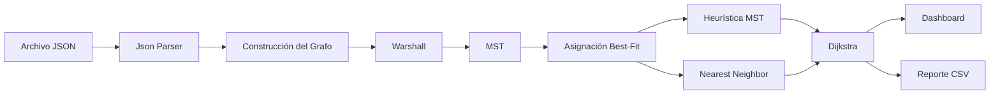
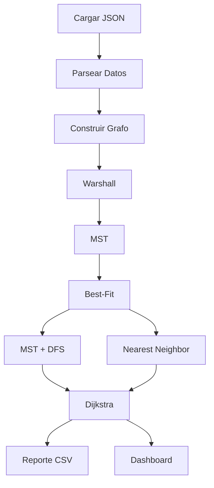

# LogísTEC

### Sistema de Optimización Logística Urbana (LGTC)


---

## Descripción General

**LogísTEC** es una plataforma de software diseñada para optimizar procesos logísticos urbanos mediante técnicas avanzadas de teoría de grafos, algoritmos de caminos mínimos, árboles de expansión mínima y heurísticas de empaquetado.

El sistema permite modelar una ciudad como una red de distribución, analizar la conectividad entre puntos de entrega, asignar paquetes a vehículos de forma eficiente y generar rutas optimizadas para la distribución de mercancías.

Este proyecto fue desarrollado bajo los lineamientos académicos del **Tecnológico de Costa Rica (TEC)** para el curso **CE1103 - Algoritmos y Estructuras de Datos I**.

---

# Tabla de Contenidos

1. [Características Principales](#-características-principales)
2. [Arquitectura del Sistema](#-arquitectura-del-sistema)
3. [Estructuras de Datos Implementadas](#-estructuras-de-datos-implementadas)
4. [Algoritmos Utilizados](#-algoritmos-utilizados)
5. [Requisitos del Sistema](#-requisitos-del-sistema)
6. [Instalación](#-instalación)
7. [Formato de Entrada](#-formato-de-entrada)
8. [Flujo de Procesamiento](#-flujo-de-procesamiento)
9. [Salida y Reportes](#-salida-y-reportes)
10. [Pruebas Unitarias](#-pruebas-unitarias)

---

# Características Principales

* Modelado de ciudades mediante grafos ponderados.
* Detección de conectividad utilizando Warshall.
* Cálculo de distancias mínimas mediante Floyd-Warshall.
* Generación de rutas reales utilizando Dijkstra.
* Construcción de Árboles de Expansión Mínima (MST).
* Asignación eficiente de paquetes mediante Best-Fit.
* Comparación de heurísticas para el problema del viajante (TSP).
* Visualización gráfica interactiva con JavaFX.
* Generación automática de reportes CSV.
* Estadísticas de rendimiento y utilización de recursos.

---

# Arquitectura del Sistema



---

# Estructuras de Datos Implementadas

Debido a las restricciones académicas del proyecto, no se permite el uso de las estructuras de datos de `java.util.*` en la lógica principal.

Por esta razón se implementaron estructuras personalizadas desde cero.

## LinkedList<T>

Lista enlazada simple genérica utilizada para:

* Almacenamiento dinámico.
* Recorridos secuenciales.
* Inserción y eliminación de nodos.

### Complejidades

| Operación   | Complejidad |
| ----------- | ----------- |
| Inserción   | O(1)        |
| Eliminación | O(n)        |
| Búsqueda    | O(n)        |

---

## Grafo por Listas de Adyacencia

Representación principal de la ciudad.

### Ventajas

* Menor consumo de memoria.
* Ideal para grafos dispersos.
* Consultas rápidas de vecinos.

### Complejidad Espacial

```text
O(V + A)
```

donde:

* V = número de vértices
* A = número de aristas

---

## Cola de Prioridad (Binary Heap)

Utilizada en:

* Dijkstra
* Construcción de MST
* Selección eficiente de nodos

---

# Algoritmos Utilizados

## Warshall

Determina si existe conectividad entre dos puntos de la ciudad.

### Aplicación

* Detectar destinos inaccesibles.
* Evitar asignaciones imposibles.

### Complejidad

```text
O(V³)
```

---

## Floyd-Warshall

Calcula todas las distancias mínimas entre pares de vértices.

### Beneficio

Permite consultas de distancia en:

```text
O(1)
```

una vez finalizado el preprocesamiento.

### Complejidad

```text
O(V³)
```

---

## Dijkstra

Genera rutas reales sobre la red urbana.

### Utilizado para

* Convertir rutas abstractas en recorridos físicos.
* Obtener caminos mínimos entre ubicaciones.

### Complejidad

```text
O((V + A) log V)
```

---

## MST (Minimum Spanning Tree)

Construye una ruta maestra que conecta todos los puntos de interés minimizando el costo total.

### Objetivo

Reducir la longitud global de distribución.

---

## Best-Fit

Heurística utilizada para la asignación de paquetes a camiones.

### Criterios

* Capacidad restante.
* Peso.
* Prioridad.
* Ubicación geográfica.

---

## Nearest Neighbor

Heurística codiciosa para aproximar soluciones al TSP.

### Estrategia

Seleccionar siempre el siguiente destino más cercano.

---

# Requisitos del Sistema

## Software

| Componente | Versión |
| ---------- | ------- |
| Java JDK   | 17 LTS  |
| Maven      | 3.8.1+  |
| JavaFX     | 17      |
| Gson       | 2.10.1  |
| JUnit      | 5       |

---

## Sistemas Operativos Compatibles

### Linux

* Ubuntu 20.04+
* Fedora
* Debian
* Distribuciones compatibles

### Windows

* Windows 10
* Windows 11

### macOS

* Monterey (12+) o superior

---

## Hardware Recomendado

| Recurso | Mínimo            | Recomendado       |
| ------- | ----------------- | ----------------- |
| CPU     | Dual Core 2.4 GHz | Quad Core 3.0 GHz |
| RAM     | 4 GB              | 8 GB              |
| Disco   | 200 MB            | 500 MB            |

---

# ⚙ Instalación

## Clonar el repositorio

```bash
git clone https://github.com/tu-usuario/LGTC.git
cd LGTC
```

## Compilar el proyecto

```bash
mvn clean compile
```

## Ejecutar la aplicación

```bash
mvn javafx:run
```

---

# Formato de Entrada

El sistema recibe información mediante un archivo JSON.

## Ejemplo

```json
{
  "ciudad": {
    "vertices": [
     {
        "id": 0,
        "tipo": "DEPOT",
        "x": 100,
        "y": 150
      }
    ],
    "aristas": [
      {
        "u": 0,
        "v": 1,
        "distancia": 12.5
      }
    ]
  },

  "paquetes": [
    {
      "id": "P01",
      "destino": 1,
      "peso": 25,
      "prioridad": 1
    }
  ],

  "camiones": [
    {
      "id": "C01",
      "capacidad": 150
    }
  ]
}
```

---

# Flujo de Procesamiento



---

# Salida y Reportes

## Reporte CSV

Al finalizar la ejecución se genera:

```text
reporte_logistica.csv
```

### Información incluida

#### Flota

* ID del camión
* Peso total transportado
* Capacidad utilizada
* Lista de paquetes
* Distancia recorrida
* Tiempo de CPU

#### Paquetes Excluidos

* ID
* Destino
* Peso
* Prioridad
* Motivo de exclusión

---

## Dashboard Estadístico

Muestra:

* Utilización de vehículos.
* Eficiencia de empaquetado.
* Comparación MST vs Nearest Neighbor.
* Tiempo de ejecución.
* Distancia total recorrida.

---

# Pruebas Unitarias

El proyecto incorpora pruebas automatizadas mediante:

* JUnit 5
* Maven Surefire

## Ejecutar todas las pruebas

```bash
mvn clean test
```

## Ejecutar pruebas en CI sin monitor gráfico

```bash
xvfb-run mvn clean -B package --file pom.xml
```

---

# Complejidades Algorítmicas

| Algoritmo        | Complejidad    |
| ---------------- | -------------- |
| Warshall         | O(V³)          |
| Floyd-Warshall   | O(V³)          |
| Dijkstra         | O((V+A) log V) |
| MST (Prim)       | O(A log V)     |
| Best-Fit         | O(n log n)     |
| Nearest Neighbor | O(n²)          |

---

# Equipo de Desarrollo

Proyecto desarrollado para:

**Tecnológico de Costa Rica (TEC)**

Curso:

**CE1103 - Algoritmos y Estructuras de Datos I**

---

# Licencia

Este proyecto tiene fines académicos y educativos.

Su uso, modificación y distribución quedan sujetos a las políticas establecidas por el curso y la institución.

## Authors

- [@JalemOG](https://www.github.com/JalemOG)

- [@Josue252525](https://www.github.com/Josue252525)

- [@wEstebanOS](https://www.github.com/wEstebanOS)


